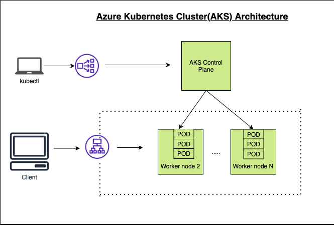
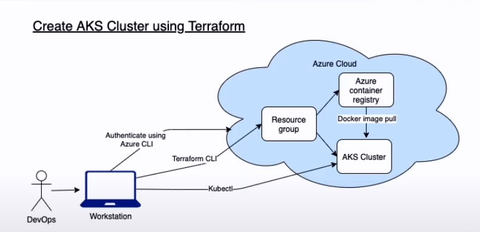

# k8s_aks


 
## mac installation
```bash
brew install azure-cli
```

## az login
```bash
az login
```

## make sure terraform CLI is installed
```bash
terraform
```

## format the tf files
```bash
terraform fmt
```

## initialize terraform Azure modules
```bash
terraform init
```

## validate the template
```bash
terraform validate
```

## plan and save the infra changes into tfplan file
```bash
terraform plan -out tfplan
```

## show the tfplan file
```bash
terraform show -json tfplan
terraform show -json tfplan >> tfplan.json
```

## Format tfplan.json file
```bash
terraform show -json tfplan | jq '.' > tfplan.json
```

## show only the changes
```bash
cat tfplan.json | jq -r '(.resource_changes[] | [.change.actions[], .type, .change.after.name]) | @tsv'
cat tfplan.json | jq '[.resource_changes[] | {type: .type, name: .change.after.name, actions: .change.actions[]}]'
```

## apply the infra changes
```bash
terraform apply tfplan
```

## move the generated Kubeconfig file to ~/.kube/config
```bash
mv kubeconfig ~/.kube/config
kubectl get nodes
```

## Deploy Nginx App
```bash
kubectl create -f https://raw.githubusercontent.com/kubernetes/website/master/content/en/examples/controllers/nginx-deployment.yaml
kubectl get deployments
kubectl get pods
```

## delete the infra
```bash
terraform destroy --auto-approve
```

## cleanup files
```bash
rm terraform.tfstate
rm terraform.tfstate.backup
rm tfplan
rm tfplan.json
rm -r .terraform/
```